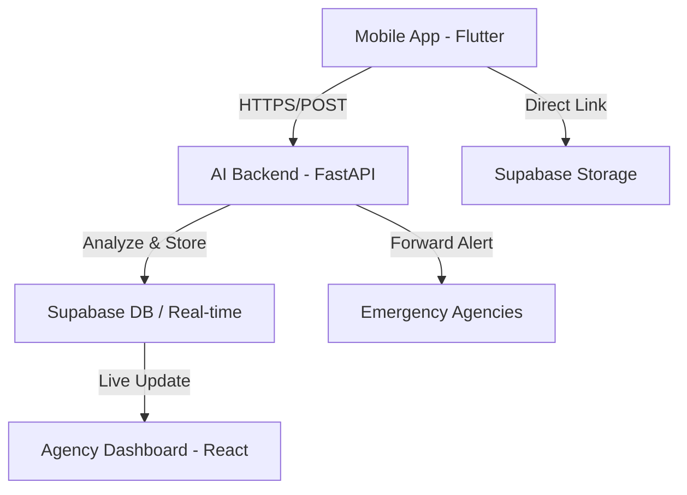

# 🚨 SafeAlert – AI-Powered SOS Emergency Response System

<p align="center">
  
</p>

<p align="center">
  <strong>Empowering safety through intelligent, real-time emergency response.</strong>
</p>

---

## 📖 Project Overview
SafeAlert is a comprehensive emergency response system designed for Codehathon 4.0. It bridges the gap between individuals in distress and emergency services using AI-driven severity classification. The system consists of a feature-rich Flutter mobile app for victims and a powerful React dashboard for agencies.

## ⚠️ Problem Statement
In emergencies, every second counts. Traditional emergency calls can be slow, prone to language barriers, and often lack precise location or context. SafeAlert automates the alert process, providing real-time data, AI-extracted severity, and automated routing to the nearest relevant agency (Police, Ambulance, or Fire).

## ✨ Key Features

### 📱 Mobile App (Flutter)
- **One-Touch SOS:** Instantly trigger an alert with minimal interaction.
- **Shake-to-Alert:** Trigger emergency mode by shaking the device (works in background).
- **Auto-Media Capture:** Automatically records 10s of audio and video for context.
- **AI-Driven Routing:** Alerts are intelligently routed based on the emergency type.
- **Offline Reliability:** Alerts are queued and sent automatically when connectivity returns.

### 🖥️ Web Dashboard (React)
- **Live Incident Map:** Real-time visualization of active emergencies.
- **Severity Heatmaps:** Identify high-risk zones using hotspot analysis.
- **Agency Management:** Coordinate responses and mark incidents as resolved.
- **Real-time Subscriptions:** Powered by Supabase for instant updates without refresh.

### 🤖 AI Backend (FastAPI)
- **Severity Classification:** Zero-shot classification using DistilBERT to prioritize HIGH, MEDIUM, and LOW alerts.
- **Multi-Language Support:** Automatically detects and translates major Indian languages.
- **Voice-to-Text:** Converts audio recordings into searchable text for responders.

---

## 🏗️ Architecture
SafeAlert uses a modern, distributed architecture to ensure high availability and responsiveness:



## 🛠️ Tech Stack
- **Mobile:** Flutter, Riverpod, Supabase SDK
- **Web Dashboard:** React, Vite, Leaflet, TailwindCSS
- **Backend:** FastAPI (Python), Node.js (API Proxy)
- **Database & Auth:** Supabase (PostgreSQL)
- **AI/ML:** Hugging Face (DistilBERT), Speech Recognition

---

## 📁 Repository Structure
```text
/mobile         # Flutter mobile application
/backend        # AI engine and API servers
  ├── /ai       # FastAPI AI server
  └── /api      # Node.js backend services
/dashboard      # React-based agency management web app
/docs           # Documentation, database schemas, and assets
```

---

## 🚀 Installation & Setup

### Prerequisites
- Flutter SDK (3.24+)
- Node.js (18+)
- Python (3.9+)
- Supabase Project

### 1. Database Setup
1. Create a project at [Supabase](https://supabase.com).
2. Run the SQL script found in `docs/database_setup.sql` in your Supabase SQL Editor.

### 2. Backend Setup
```bash
cd backend/ai
pip install -r requirements.txt
python main.py
```

### 3. Dashboard Setup
```bash
cd dashboard
npm install
npm run dev
```

### 4. Mobile App Setup
```bash
cd mobile
flutter pub get
flutter run
```

---

## 🔗 Demo & APK
- **Live Demo Site:** [View Dashboard](https://your-demo-url.com)
- **APK Download:** [Download Latest APK](#releases)

---

## 📦 Releases
To download the compiled application:
1. Navigate to the **[Releases](https://github.com/the-bhuvi/Codehathon-4.0-SOS-app/releases)** section of this repository.
2. Download the `SafeAlert-Release.apk`.
3. Install on your Android device (ensure "Install from Unknown Sources" is enabled).

---

## 🤝 Contributing
We welcome contributions! Please see our [Contributing Guide](docs/CONTRIBUTING.md) for details on how to get started.

## 📄 License
This project is licensed under the MIT License.

---
<p align="center">Made with ❤️ for Codehathon 4.0</p>
